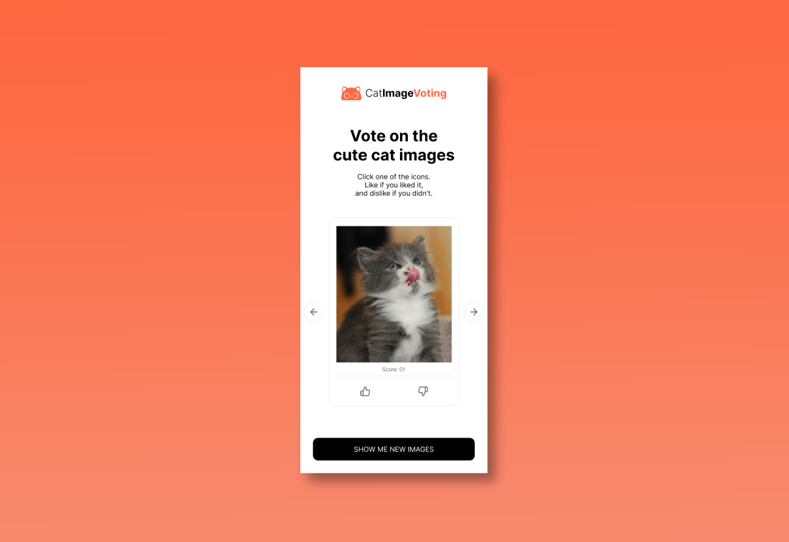
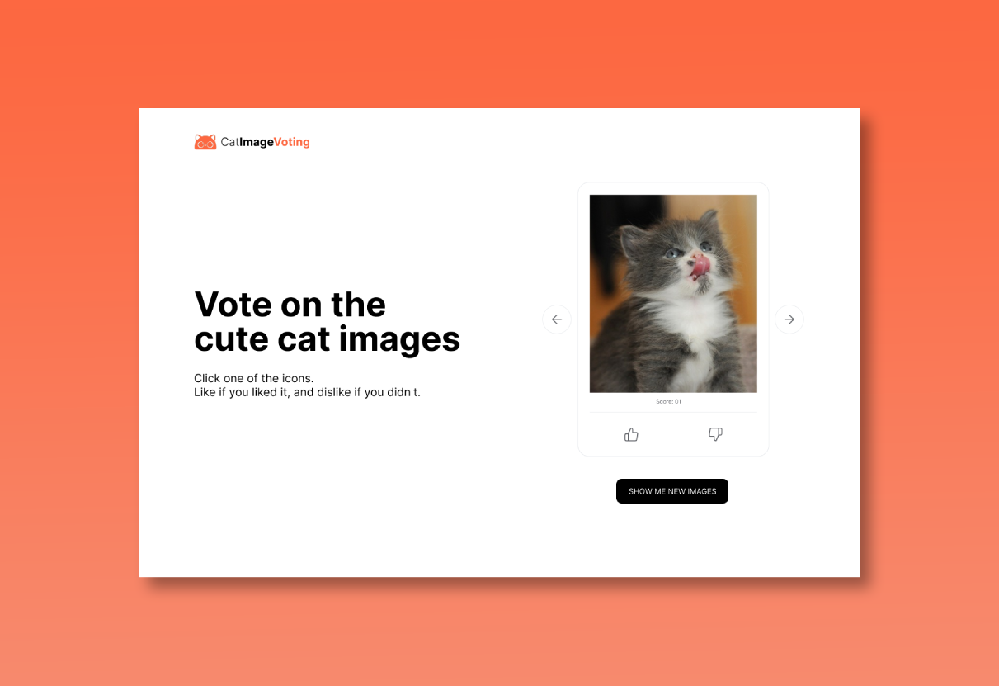

# 🐾 Cat Image Voting App

## About the Project

**Cat Image Voting** is a modern and responsive web application that allows users to browse random cat photos and vote on them with a simple Up or Down system. Votes are persisted through TheCatAPI, and each user is uniquely identified to keep track of their interactions.

Whether you're a cat lover or just want to test a clean React + TypeScript project, this app delivers an engaging experience with smooth animations and instant feedback.

The application provides core features such as:

- 🐱🐱 **List** - List and view photos and GIFs of cute kittens.
- 👍👎 **Vote** - Vote on photos, identifying which ones you liked and which ones you didn't.
- 📈 **Score** - View each photo's score.
- ❤️💔 **Visual feedback on the card** - See if you've already voted on a photo and whether your vote was positive or negative.
- 🖼️ **New batch of photos** - Request a new batch of photos for you to view and vote on.
- 🚨 **Action feedback** - Receive success or error messages when voting or creating a new batch of images.

👉 [Click here to access the deployed application](https://cat-image-voting-app-five.vercel.app/)

## ✨ Figma Design

The entire app layout was designed using **Figma**.  
You can view the design here:  
👉 [Figma Project Link](https://www.figma.com/design/ffcS9ZL5vOtn8o3vxCDTbZ/Untitled?node-id=1093-2&t=JzgPt4IQ1lDEonnt-1)

### Mobile View



### Desktop View



## Features

- **Gallery** – Display a carousel of cats.
- **Voting** – Each card has Up and Down buttons and them are disable them once the user selects.
- **Inline Score** – After voting, instantly show the current total score returned from
the POST response.
- **Persistent Identity** – Generate a `sub_id` once (save in localStorage); reuse it for
all requests so each visitor’s votes are tracked.
- **Refresh** – Button to fetch a new batch of images
- **Local State Management** using `useState`.
- **Global state managed** using React Context API for centralized state management across components
- **Performance Optimization** with `useCallback`.
- **Accessibility** (ARIA roles, keyboard navigation).
- **Responsive Layout** using Tailwind CSS (Mobile First).
- **Unit Testing** using React Testing Library and Jest.

## Technologies Used

- **React 19**
- **TypeScript**
- **Vite**
- **Tailwind CSS**
- **React Context API for state management**
- **Axios for HTTP requests**
- **Sonner for toast notifications**
- **Chadcn**
- **Jest + React Testing Library**
- **React Feather Icons**
- **ESLint & TypeScript ESLint**

## Installation:

To run the project locally, follow the steps below:

### 1. Prerequisites

Before running this project locally, make sure you have the following installed:

- **Node.js** (v18 or later) — [Download here](https://nodejs.org/)
- **npm** (comes with Node.js) or **yarn**
- A modern code editor like [Visual Studio Code](https://code.visualstudio.com/)

You can verify your versions by running:

```bash
node -v
npm -v
```


### 2. Clone the repository

```bash
git clone https://github.com/leandrofc/cat-image-voting-app.git
```

### 3. Access the project directory:

```sh
cd cat-image-voting-app
```

### 4. Install dependencies

```bash
npm install
```

### 5. You will need to create a free API key on TheCatApi

- **TheCaTApi** — [click here to go to the website](https://thecatapi.com/)
- **Create your account and log in**
- **Create an api key**
- **Copy your api key, because you will need it later**

### 6. Set Your API Key

- **Create the file** — in the root of the project create a file called .env.local
- **Add your api key on the file** — in the .env.local add the following content putting your api key in place of "your_api_key_here"
```bash
VITE_CAT_API_KEY=your_api_key_here
```

### 7. Start the development server

```bash
npm run dev
```

## Running Tests:

To run the unit tests:
```bash
npm run test
```